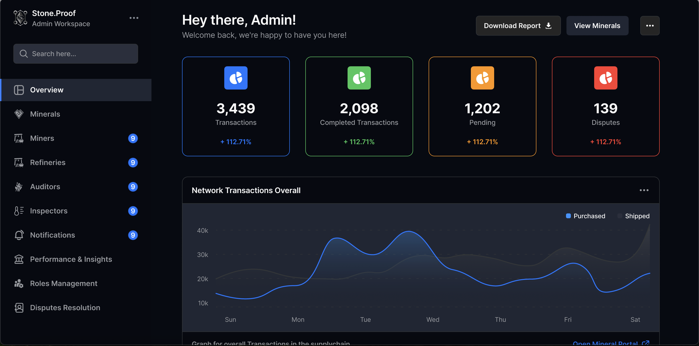
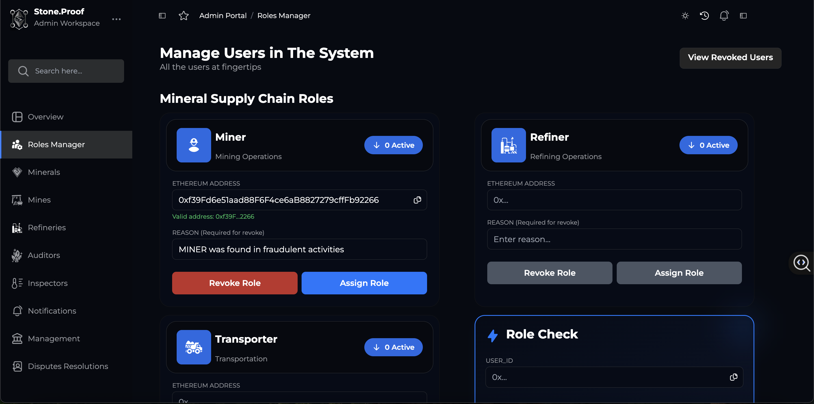
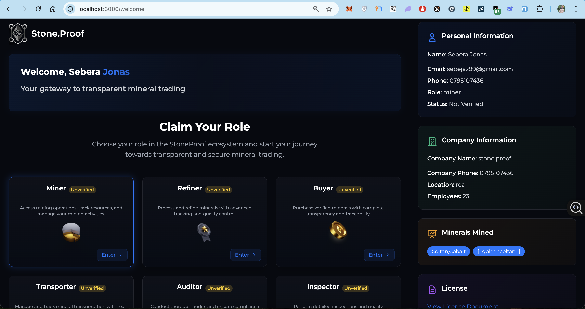
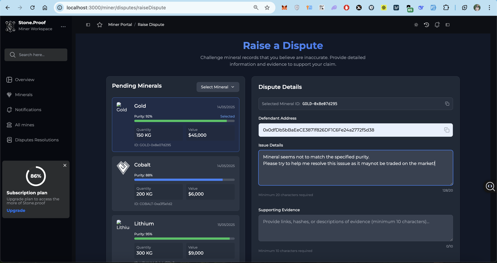

# Stone.proof.eth: Trust. Trace. Transact.

Stone.proof is a modular, decentralized mineral traceability platform built on Base Layer 2. It empowers supply chain actors to register, validate, and trade mineral assets with integrity, verifiable origin, and strict access control.

Built for security, scale, and enterprise reliability.

---

## Table of Contents

- [Overview](#overview)
- [Key Features](#key-features)
- [Role-Based Portals](#role-based-portals)
- [Access Control](#access-control)
- [Smart Contracts](#smart-contracts)
- [Project Structure](#project-structure)
- [Tech Stack](#tech-stack)
- [How It Works](#how-it-works)
- [Demo (Coming Soon)](#demo-coming-soon)
- [License](#license)
- [Author](#author)

---

## Overview

StoneProof addresses the challenges of transparency and accountability in the mineral supply chain. By leveraging smart contracts and role-gated interfaces, it enables authorized users to manage mineral data securely, with all actions tracked immutably on-chain.

Each participant operates within a dedicated portal based on their assigned role. Wallet verification and role enforcement happen in real time using Base-native tooling.

---

## Key Features

- **Multi-Role Architecture**  
  Isolated portals for each actor in the supply chain with strict wallet-based role verification.

- **ERC721-Based Mineral Tokenization**  
  Minerals are registered and minted as unique NFTs, embedding proof of origin, status, and ownership.

- **Validation Workflow**  
  Supervisory roles (Auditors, Inspectors) validate minerals before trade, ensuring data integrity.

- **Real-Time Role Control**  
  Admin-controlled role assignment and revocation reflected instantly in the frontend portals.

- **Base Layer 2 Optimized**  
  Low gas fees and high throughput for scalable, on-chain logistics.

---

## Role-Based Portals

| Portal                | Role(s)                | Capabilities                                   |
|-----------------------|------------------------|------------------------------------------------|
| Miner Portal          | MINER                  | Register minerals, view registered tokens      |
| Refinery Portal       | REFINER                | Refine, tag, and forward processed batches     |
| Warehouse Portal      | REFINER                | Track mineral storage and prepare for sale     |
| Buyer Portal          | BUYER                  | View and acquire validated minerals            |
| Transporter Portal.   | TRANSPORTER.           | Transfer minerals from origin to destination.  |
| Supervision Portal    | AUDITOR, INSPECTOR, SUPER_ADMIN | Validate minerals, resolve disputes, audit records |

Only wallet addresses with valid roles may access their respective portals. All others are automatically blocked or redirected.

---

## Access Control

Access is enforced using on-chain roles through the `RolesManager` smart contract.

- Role-based checks occur during wallet connection.
- Frontend portals are protected using Wagmi-based guards.
- Super Admins can grant or revoke roles directly on-chain.
- Unauthorized access attempts are handled gracefully in the UI.

---

## Smart Contracts

### 📂 Smart Contracts Overview

| Path & Contract                         | Purpose                                                                 |
|----------------------------------------|-------------------------------------------------------------------------|
| 📁 core                                 |                                                                         |
| ├── `RolesManager.sol`                 | Manages role assignments and wallet-based access control                |
| ├── `SupplychainValidator.sol`         | Handles validation workflows by auditors and inspectors                 |
| └── `PrivacyGuard.sol`                 | Provides privacy and data masking mechanisms where required             |
| 📁 governance                           |                                                                         |
| └── `DisputeResolution.sol`            | Handles dispute resolution for contested validations                    |
| 📁 interfaces                           |                                                                         |
| ├── `ILogisticsManager.sol`            | Interface for logistics operations                                      |
| ├── `IMineralRegistry.sol`             | Interface for mineral registration                                      |
| ├── `IMineralWarehouse.sol`            | Interface for warehouse management                                      |
| ├── `IRolesManager.sol`                | Interface for role control                                              |
| ├── `ISupplychainValidator.sol`        | Interface for supply chain validation                                  |
| ├── `ITokenization.sol`                | Interface for tokenization module                                       |
| └── `ITransactionLog.sol`              | Interface for on-chain transaction logs                                 |
| 📁 logs                                 |                                                                         |
| └── `TransactionLog.sol`               | Emits/stores event logs for traceability                               |
| 📁 modules                              |                                                                         |
| ├── `LogisticsManager.sol`             | Orchestrates mineral shipment and routing                              |
| ├── `MineralRegistry.sol`              | Registers and tracks raw minerals                                      |
| └── `MineralWarehouse.sol`             | Manages storage and inventory states                                   |
| 📁 tokens                               |                                                                         |
| └── `Tokenization.sol`                 | ERC721-based tokenization of mineral assets                            |
| 📁 utils                                |                                                                         |
| ├── `DataTypes.sol`                    | Shared structs and data formats                                        |
| ├── `Errors.sol`                       | Common error definitions                                                |
| └── `Events.sol`                       | Shared event declarations                                               |

## Getting started

---

## Tech Stack

- **Blockchain & Contracts**
  - Solidity (OpenZeppelin-based)
  - Hardhat
  - Base Layer 2 Network
  - Hardhat Deploy

- **Frontend & Wallet Integration**
  - Next.js 14 (App Router)
  - Wagmi + Viem
  - WalletConnect
  - Base OnchainKit

- **UI/UX**
  - TailwindCSS
  - Shadcn/UI Components
  - Lucide Icons
  - Framer Motion Animations

---

## How It Works

1. **User connects wallet** via Wagmi + WalletConnect.
2. **Portal access** is granted or denied based on wallet role.
3. **Actions per role:**
   - Miners register minerals → mint ERC721 tokens.
   - Refiners update batch status and forward materials.
   - Inspectors and Auditors validate asset status or reject invalid data.
   - Buyers purchase approved assets.
   - Transporter transfer mineral from origin to destination
4. **Super Admin** can asign or revoke roles as needed.

All actions are tracked on-chain for accountability and traceability.

---

## Enables raising and resolution og disputes under disputeResolution portal

## Demo (Coming Soon)

Deployment to Base Sepolia testnet is underway. A live demo link will be added shortly. Judges and reviewers will be able to:

- Connect MetaMask or WalletConnect
- Navigate through portal-specific flows
- View token metadata and role-based actions in real-time

---

## License

MIT License © 2025 StoneProofLabs Contributors

---

## Author

**Built by:** _**StoneProofLabs**_
- [@0xJonaseb11](https://github.com/0xJonaseb11)
- [@NyLaurent](https://github.com/NyLaurent)
- [@Aimable01](https://github.com/Aimable01)
- [@ashrafutuyubahe](https://github.com/ashrafutuyubahe)

**Contact**: <stone.prooflabs@gmail.com>
 
**GitHub**: <https://github.com/StoneProofLabs>

---

`Stone.proof` is built to restore trust in mineral transactions through blockchain transparency.
